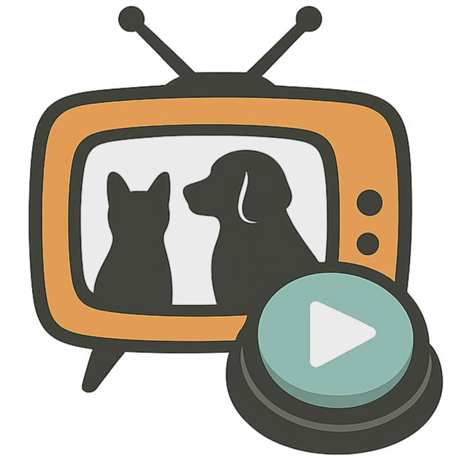

# 🐾 PawVision

PawVision is a Raspberry Pi-based "Pet TV" system that plays random videos for your pet on an HDMI monitor with a pet-friendly interface and a modern web based control interface.

## Features

- Local video playbook from `/home/pi/videos` or USB stick
- Random start time within `(duration - timeout)`
- Timeout auto-stop with automatic monitor control
- Volume control with night mode (mute during certain hours)
- Button control with optional second-press stop
- Button disable schedule
- Play schedule (automatic playbook at set times with easy time picker interface)
- Modern web UI with warm, pet-friendly colors
- Simplified API for essential controls
- Optional GPIO monitor power control (automatic on/off with video playback)

## Installation / Update

Run this one-liner on your Raspberry Pi:

```bash
curl -sSL https://raw.githubusercontent.com/<yourusername>/pawvision/main/install.sh | bash
```

This will:

- Install dependencies
- Download the latest PawVision
- Keep your videos and settings
- Merge in new settings if added

## Web UI

After installation, open:

```
http://<pi-ip>:5000
```

The web interface features:

- **Modern Design**: Pet-friendly color scheme with warm orange and soft teal
- **Easy Controls**: Play/Stop buttons prominently displayed at the top
- **Video Management**: Simple upload and playlist management
- **Schedule Builder**: Interactive time picker for setting up automated playback times
- **Comprehensive Settings**: All configuration options in one place

## API Endpoints

- `POST /api/play` → Start playback (automatically turns monitor on)
- `POST /api/stop` → Stop playback (automatically turns monitor off)

## Home Assistant Example

```yaml
rest_command:
  pawvision_play:
    url: "http://192.168.1.50:5000/api/play"
    method: POST
  pawvision_stop:
    url: "http://192.168.1.50:5000/api/stop"
    method: POST
```

## Monitor Control

The monitor is automatically controlled:

- **Turns ON** when video playback starts
- **Turns OFF** when video stops (timeout, manual stop, or button press)
- No manual monitor control needed - it's all automatic!

## Default Video Folder

Place videos in:

```
/home/pi/videos
```

Or plug in a USB stick (auto-mounted to `/media/usb`).

## License

MIT
