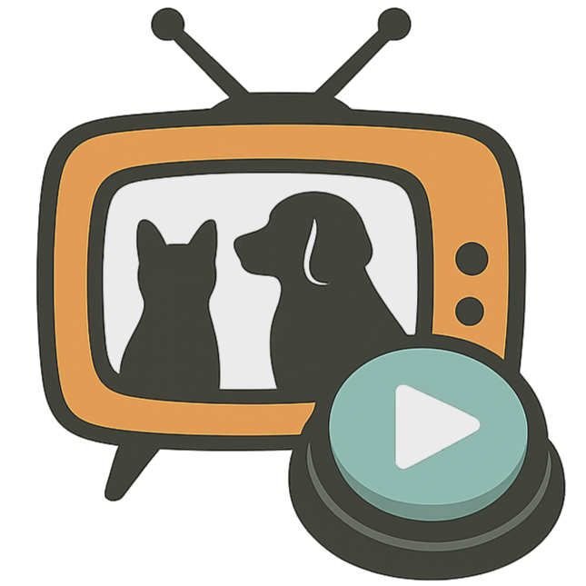

[](https://www.gnu.org/licenses/agpl-3.0)



# 🐾 PawVision

PawVision is a Raspberry Pi-based "Pet TV" system that plays random videos for your pet on an HDMI monitor with a pet-friendly interface and a modern web based control interface.

## 🚀 Quick Start

```bash
curl -sSL https://raw.githubusercontent.com/mkroemer/pawvision/main/install.sh | bash
```

Then open `http://<pi-ip>:5001` in your browser.

## Deployment and security

PawVision listens on loopback by default. The supplied systemd installers and
Docker Compose configuration explicitly expose it on port `5001` for LAN use.
Use `PAWVISION_HOST`, `PAWVISION_PORT`, and `PAWVISION_DATA_DIR` to customize a
deployment.

For a shared network, set a long random `PAWVISION_SECRET_KEY`. To protect
state-changing API requests from scripts or reverse proxies, set
`PAWVISION_API_TOKEN` and send it as the `X-PawVision-Token` request header.

## 📚 Documentation

Complete documentation is available at: **[PawVision Docs](https://mkroemer.github.io/PawVision/)**

- [🏠 Home](https://mkroemer.github.io/PawVision/) - Overview and quick start
- [🏗️ Architecture & Pi Roadmap](https://mkroemer.github.io/PawVision/architecture.html) - Focused architecture guidance for a small Raspberry Pi setup
- [⚙️ Configuration Guide](https://mkroemer.github.io/PawVision/configuration.html) - Complete setup and configuration
- [� API Reference](https://mkroemer.github.io/PawVision/api.html) - REST API documentation
- [🔧 Hardware Setup](https://mkroemer.github.io/PawVision/hardware.html) - Hardware connection and configuration
- [� Development](https://mkroemer.github.io/PawVision/development.html) - Development and testing guide
- [🚀 Release Notes](https://mkroemer.github.io/PawVision/releases.html) - Latest updates and changes

## ✨ Key Features

- **Smart Video Playback**: Local video library with random selection and timing
- **Night Mode**: Automatic volume control during sleeping hours
- **Physical Controls**: GPIO button with configurable behavior
- **Motion Detection**: Optional motion sensor integration
- **Web Interface**: Modern, human-friendly control panel
- **Scheduling**: Automated playback at set times
- **Statistics**: Track viewing patterns and usage
- **API Integration**: REST endpoints for Home Assistant and other systems

## 🎯 Perfect For

- Dogs and cats who enjoy visual entertainment
- Pet owners who want to keep pets engaged while away
- Home automation enthusiasts
- Raspberry Pi hobbyists

## 📄 License

This project is licensed under the [GNU AGPL v3](https://www.gnu.org/licenses/agpl-3.0) - see the [LICENSE](LICENSE) file for details.

## 🤝 Contributing

1. Fork the repository
2. Create a feature branch
3. Make your changes
4. Submit a pull request

## ⭐ Support

If you find PawVision helpful, please star the repository and share it with other pet owners!

[](https://ko-fi.com/S6S41AWBB8)

## 🧪 Running Tests

PawVision uses [pytest](https://docs.pytest.org/) for all unit and integration tests. All test files are located in the `tests/` directory and are organized by domain (e.g., config, statistics, web interface).

Install [uv](https://docs.astral.sh/uv/) and create the locked development environment:

```bash
uv sync --locked --group dev
```

PawVision supports Python 3.9 and newer.

To run all tests:

```bash
uv run pytest tests/ -v
```

To run a specific test file:

```bash
uv run pytest tests/test_config.py -v
```

To run a specific test class:

```bash
uv run pytest tests/test_config.py::TestConfigManager -v
```

To run a specific test class in a file:

```bash
uv run pytest tests/test_config.py::TestConfigManager -v
```

All tests should pass before submitting changes. Logging errors during test shutdown are harmless and only occur in test environments.

## 🛠️ Writing Tests

- Place new tests in the appropriate domain file in `tests/`
- Use the `unittest` framework (pytest will auto-discover)
- Test files should be named `test_*.py`
- Use temporary files and directories for isolation
- Mock hardware and external dependencies for reliability

## 🧑‍💻 Developer Documentation

See [docs/configuration.md](docs/configuration.md) for setup, and [docs/api.md](docs/api.md) for API details. For test development, see the section above and the developer notes in each test file.
